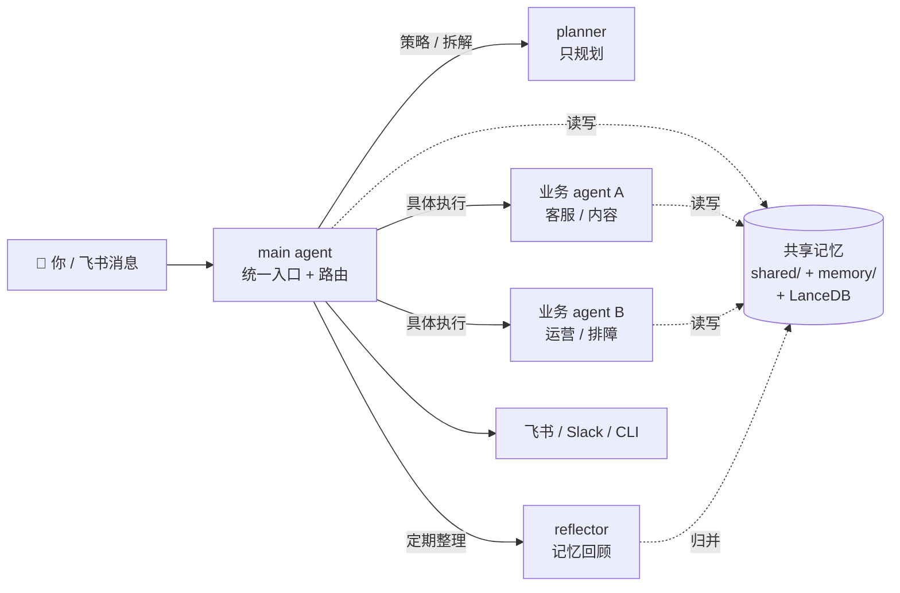

> 3 分钟读完。决定你要不要继续读这本教程。

---

## 30 秒看懂 OpenClaw 是干嘛

**一句话**：OpenClaw 是一个跑在你电脑上的「多 agent 协作 runtime」。把 Claude / GPT 等模型组成一个 7×24 小时活着的「家族」，能记忆、能派活、能接飞书。

**画给你看**：



**和「单轮 ChatGPT」的区别**：单轮问答是「你问一句它答一句，下次见面失忆」。OpenClaw 是「常驻家族 + 共享记忆 + 后台主动干活 + 互相派单」。代价是配置复杂、运维有学习曲线 —— 这本教程就是把这层学习曲线削平。

---

## 5 分钟跑一个 hello world

只想先看看长什么样？跟着这 5 步：

```bash
# 1. 装 CLI（需要 node 18+）
npm install -g openclaw

# 2. 初始化家目录
openclaw setup
# 跟着问答走，配 1 个模型 provider 即可（OpenAI / Anthropic / 国内任选）

# 3. 起 gateway
openclaw gateway run

# 4. 在另一个终端跟 main agent 说话
openclaw chat main
> 你好，介绍一下你自己

# 5. 看记忆有没有写进去
ls ~/.openclaw/memory/main/
```

跑通了 → 进 [01-入门/01-安装](./01-入门/01-安装.md) 学完整安装；跑挂了 → 进 [05-排障/00-常见问题](./05-排障/00-常见问题.md)。

> **提示**：如果你想直接搭多 agent 协作系统（不只是 hello world），看完 01-入门后跳 [03-多Agent/00-协作拓扑](./03-多Agent/00-协作拓扑.md)。

---

## 这本教程是什么

**一本 OpenClaw 实战手册。** 作者用 OpenClaw 连续跑了 20+ 天生产系统（飞书多 agent 协作 + 记忆系统 + 周审卡片 + 运维自愈），把踩过的坑、验证过的路径写下来。

**它不是 OpenClaw 官方文档**，而是把"官方没写、只能靠踩坑得出"的那部分经验系统化。

---

## 谁应该读

**应该读**：

- 已经或即将装 OpenClaw，想搭**多 agent 协作系统**的开发者
- 想把 AI agent 接飞书做**团队协作 / 私域运营 / 内部自动化**的个人或小团队
- 吃过"agent 没记忆"、"配置一改就崩"、"升级一次炸一次"的苦

**不应该读**：

- 只想跑一个单轮问答机器人 —— 直接用 ChatGPT API 更快
- 对命令行、JSON 配置、日志排查毫无经验 —— 先补基础
- 想要"一键部署"体验 —— OpenClaw 设计上就不是一键工具，门槛是它的特性

---

## 本教程分两档

### 📖 档位 1 · `docs/` 免费公开

你现在读的就是这一档。方法论 + 踩坑记录 + 命令清单，在线可读、持续更新。读完能**自己动手搭**出可用系统。

**许可**：CC BY-NC-ND 4.0 —— 可读、可引用、禁商业转载、禁二次分发改编版。

### 🔐 档位 2 · `templates/` + `guided-install/` 付费解锁

去个性化的架构骨架：5+ agent 协作配置样例、shared/ 规范模板、运维脚本模板、问答式安装脚本。适合**想跳过架构设计阶段直接搭框架**的用户。

**它不是**把作者的 `~/.openclaw/` 打包复制给你（那样做既侵犯隐私、又不符合每个人的业务场景）。而是**按你的业务问答生成骨架**。

详见 `meta/TERMS.md`。

---

## 为什么值得读

每条命令、每个路径、每段配置，作者都在自己的生产环境跑过。所有文件的重写状态追踪在 [`_REWRITE_STATUS.md`](./_REWRITE_STATUS.md)：

- 🟢 **verified** 已基于真实 CLI + 实测文件重写
- 🟡 **partial** 结构可信，个别字段待官方文档补齐
- 🔴 **scaffold** 自动生成的草稿（**当前 v1.0.0 已无 🔴 章节**）

当前 22 章全部 🟢，每次发版前都会按 `meta/RELEASE_CHECKLIST.md` 跑一遍 audit。

---

## 推荐阅读路径

```
00-先读我（你在这）
  ↓
01-入门/00-概述       ← OpenClaw 核心概念（5 分钟，🟢 已实测）
  ↓
01-入门/01-安装       ← 第一次跑通（30-60 分钟，🟢 已实测）
  ↓
01-入门/02-基础配置    ← shared/ + bootstrap-extra-files（🟢 已实测）
  ↓
01-入门/03-验证        ← 八维验证矩阵
  ↓
02-配置/01-记忆系统    ← 五层记忆架构（🟢 已实测）
  ↓
03-多Agent/00-协作拓扑 ← 多 agent 设计原则
  ↓
分叉
  ├── 继续深入 docs/ 自己搭
  └── 购买档位 2，用模板 + 引导脚本跳过架构设计
```

**不要跳 01-入门/01-安装。** 后续所有章节都假设你已经把 gateway + doctor 跑通。

---

## 阅读原则

1. **每步验证再继续。** "装完没验证直接跑下一步"是这本教程里 90% 踩坑的根源。
2. **所有配置改动先备份。**<br />`cp openclaw.json openclaw.json.bak` 是好习惯。
3. **出问题先看日志。** `~/.openclaw/logs/gateway.err.log` 比任何 GPT 回答都管用。
4. **不要把 `~/.openclaw/credentials/` 的内容提交到 git。** 权限 600，配好 `.gitignore`。

---

## 版本说明

本教程基于 **OpenClaw 2026.4.14+** 编写，最后更新 **2026-04-18**。

OpenClaw 迭代快，升级后建议：

1. 看 [OpenClaw 更新日志](https://github.com/openclaw/openclaw/blob/main/CHANGELOG.md)
2. 跑 `openclaw doctor` 确认兼容
3. 若 doctor 报错，查 `06-升级/00-npm升级兼容` 章节（含 `apply-openclaw-cli-hotfixes.mjs` 用法）

---

## 遇到问题

按顺序来：

1. **先翻 [FAQ](./FAQ.md)** —— 20 个最高频问题速查
2. `openclaw doctor` —— 先让官方自检工具说话
3. `~/.openclaw/logs/gateway.err.log` —— 看报错原文
4. 搜 [docs/05-排障/](./05-排障/00-常见问题.md) —— 这本教程的排障集
5. 官方 GitHub Issues —— 如果是 OpenClaw 本身的 bug

---

## 反馈与商用

- **发现错误或过时内容**：开 GitHub Issue（见 repo 顶部）
- **想商用档位 2 模板**：看 `meta/TERMS.md`
- **想引用本教程**：按 CC BY-NC-ND 4.0，注明作者 + 链接即可
