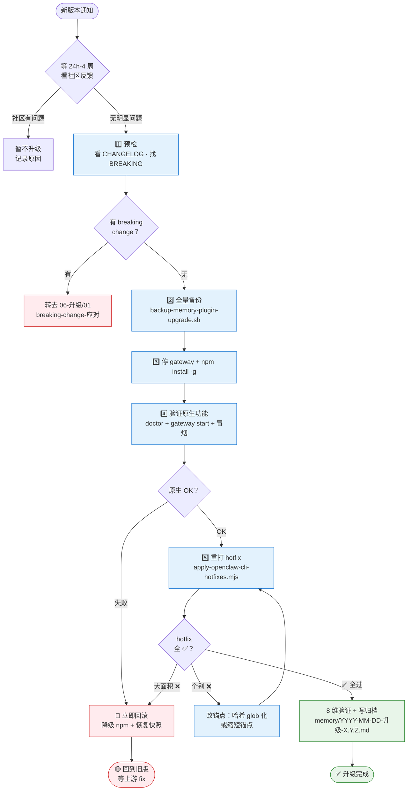

> 预计阅读：13 分钟
> 适用版本：OpenClaw 2026.4.24 稳定基线 · 最后审核：2026-05-02
> 前置：[00-健康检查](./00-健康检查.md) / [03-备份与恢复](./03-备份与恢复.md) / [06-升级/00-npm升级兼容](../06-升级/00-npm升级兼容.md)
> 本章回答：**OpenClaw 出新版本时，怎么升级？补丁怎么重打？搞砸了怎么回滚？**

---

## 升级的四种触发场景

| 场景 | 风险 | 流程 |
|---|---|---|
| **日常 patch 版**（如 2026.4.14 → 2026.4.15） | 低 | 五步常规升级 |
| **minor 版**（如 2026.4.x → 2026.5.0） | 中 | 五步 + 观望窗口 |
| **major 版**（如 2026.x → 2027.x） | 高 | 先读 CHANGELOG + 等社区踩坑 + 沙盒测试 |
| **hotfix 自研补丁** | 低但高频 | 重跑 `apply-openclaw-cli-hotfixes.mjs` |

**本章覆盖** patch / minor 常规升级。major 版本的 breaking change 处理看 [06-升级/01-breaking-change-应对](../06-升级/01-breaking-change-应对.md)。

---

## 核心原则

### 原则 1：升级前**先备份**，永远

哪怕是 patch 版也要备份。作者踩过两次坑：

- 2026-03-XX：某 patch 版破坏了 LanceDB 索引结构，fragments 爆
- 2026-04-XX：某 minor 版引入 hook 变更，bootstrap 顺序微变，hooks 配置失效

**备份成本 < 1 分钟，恢复成本 > 1 小时**，不要省。

### 原则 2：**先升级再 hotfix**

不要"升级时顺便改 hotfix"。顺序是：

```
升级 npm → 验证原生功能 OK → 重跑 hotfix → 再验证
```

原因：原生故障和 hotfix 故障要**分开定位**，混一起根本查不出。

### 原则 3：**等一两天再升**

看到新版本发布，**不要**立刻升。等 24-48 小时，看：

- OpenClaw 社区里有没有人报"升级后 X 坏了"
- 你依赖的插件（如 openclaw-lark / memory-lancedb-pro）是否兼容新版

作者原则：patch 版等 24h，minor 版等 3-7 天，major 版等 2-4 周。

### 原则 4：模板基线优先于 npm 最新版

如果你使用的是带安装器和本地补丁的模板，不要把 `npm view openclaw` 里的最新版当作默认目标。
模板还有自己的 runtime 基线，例如当前稳定链路固定在：

```text
OpenClaw core = 2026.4.24
```

这条基线同时约束：

- gateway 服务启动方式
- memory-lancedb-pro 本地补丁
- openclaw-lark 补丁
- housekeeper 巡检
- 买家安装和在线更新脚本

只有当这些都确认兼容后，才应该把基线往上提。

---

## 五步升级工作流

### 总览图



**关键决策点**：每个菱形都是「可能回滚」的分叉点，不要硬冲。

---

### 第 1 步：预检

```bash
# 1.1 确认当前版本
openclaw --version

# 1.2 确认目标版本的 CHANGELOG
npm view openclaw versions --json | tail -5
# 或访问 CHANGELOG 页面

# 1.3 看目标版本有没有 breaking change
# 重点关注 "BREAKING" / "Removed" / "Renamed" 关键字
```

**判断题**：有 breaking 就**停**，改走 [06-升级/01-breaking-change-应对](../06-升级/01-breaking-change-应对.md)。

### 第 2 步：全量备份

```bash
# 2.1 升级前完整快照（包含 lancedb-pro / 配置 / agents）
bash ~/.openclaw/scripts/backup-memory-plugin-upgrade.sh
# 输出：~/Desktop/openclaw-backup-YYYYMMDD-HHMM.tar.gz

# 2.2 记下快照文件名，万一回滚要用
ls -lht ~/Desktop/openclaw-backup-*.tar.gz | head -1
```

**快照保留期**：至少到下次升级成功 + 稳定运行 1 周后再删。

### 第 3 步：停 gateway + 升级

```bash
# 3.1 停 gateway（避免升级时有进程还在写文件）
openclaw gateway stop

# 3.2 等进程完全退出
ps aux | grep openclaw | grep -v grep
# 应为空

# 3.3 升级
npm install -g openclaw@latest
# 或指定版本：npm install -g openclaw@2026.4.15

# 3.4 确认版本变了
openclaw --version
```

### 第 4 步：验证原生功能

**不要立刻跑 hotfix**。先确认新版本**没打补丁时**能跑起来：

```bash
# 4.1 doctor 基础自检
openclaw doctor

# 4.2 启 gateway
openclaw gateway start

# 4.3 轮询等 OK
until openclaw gateway status | grep -q '^OK:'; do
  sleep 2
done

# 4.4 检查 CLI 和 gateway 服务路径是否同源
bash ~/.openclaw/scripts/runtime-status-report.sh 2>/dev/null || true

# 4.5 冒烟测试：发一条直聊消息给 main agent
# （通过你的消息渠道，或用 openclaw 的测试指令）
```

**验证通过 → 继续第 5 步。**
**验证失败 → 立即回滚**（见下）。不要硬往下试。

### 第 5 步：重打 hotfix + 最终验证

```bash
# 5.1 重跑 hotfix（锚点匹配方式）
node ~/.openclaw/scripts/apply-openclaw-cli-hotfixes.mjs

# 5.2 查看输出，确认每条 patch 的状态：
# ✅ applied / ⚠️ already-applied / ❌ anchor-not-found

# 5.3 如果有 ❌ anchor-not-found，看 06-升级/00-npm升级兼容.md 处理
```

重启 gateway 再做完整的 8 维验证（见 [01-入门/03-验证](../01-入门/03-验证.md)）。

---

## hotfix 锚点失效的两种成因

**升级后最常见的问题**。详见 [06-升级/00-npm升级兼容](../06-升级/00-npm升级兼容.md)，这里列最小修复流程：

### 成因 1：dist 哈希轮换

新版本构建产物的文件名带了新的 hash，hotfix 里写死的老文件名 grep 不到。

**修复**：动态识别。把 hotfix 里的 `cli.abc123.js` 改成 glob：

```javascript
const target = glob.sync(path.join(distDir, 'cli.*.js'))[0];
```

### 成因 2：upstream 插入了代码

OpenClaw 上游在锚点代码附近插入了新行，导致多行锚点断裂。

**修复**：把锚点缩到最短。原本：

```javascript
const ANCHOR = `function renderStatus(agent) {\n  const color = getStatusColor(agent);\n  return ...`;
```

改成只锚定**不会变**的那一行：

```javascript
const ANCHOR = `function renderStatus(agent) {`;
```

---

## 回滚流程

### 何时立即回滚

- 升级后 `openclaw doctor` 报错
- gateway 启不来，超过 5 分钟
- 核心 agent（main）响应异常
- hotfix 大面积失配且无法快速修复

### 回滚步骤

```bash
# 1. 停 gateway
openclaw gateway stop

# 2. 降级 npm 版本（用升级前的版本）
npm install -g openclaw@__PRE_VERSION__  # 换成你的前一个版本号

# 3. 恢复快照（如果升级破坏了数据）
bash ~/.openclaw/scripts/restore-memory-plugin-upgrade.sh --apply \
  ~/Desktop/openclaw-backup-YYYYMMDD-HHMM.tar.gz

# 4. 重启
openclaw gateway start

# 5. 验证回到老版本
openclaw --version
openclaw doctor
```

**回滚后要做什么**：

- 在 github issues 搜 / 提相关问题
- 等上游 fix 版本
- 同时维护 hotfix 的缩短锚点改动（减少下次升级的摩擦）

---

## 升级链条：通知 → 执行 → 归档

一次完整的升级动作链路：

```
1. 收到新版本通知（RSS / 定时 check）
2. main agent 推送到用户："OpenClaw 有新版本 X.Y.Z，建议等 __PLACEHOLDER_WAIT_DAYS__ 天"
3. 用户点"现在升级"/"等等"
4. 执行升级五步
5. 结果写 memory/YYYY-MM-DD-openclaw-升级-X.Y.Z.md
6. 更新 shared/MEMORY.md 的"升级历史"章节
```

建议把这条流程做成 **yying** 之类的运营 agent 的职责（或 main 兼任）。

---

## 日志该看哪些

升级过程中重点关注：

| 日志 | 看什么 |
|---|---|
| `~/.openclaw/logs/gateway.log` | 启动是否正常 |
| `~/.openclaw/logs/gateway.err.log` | 有没有新的 ERROR（尤其是 hook / plugin 加载失败） |
| `hotfix-apply.log`（如果你的 hotfix 脚本有写） | 每条 patch 的状态 |
| npm 安装输出 | 有没有依赖冲突 / deprecated 警告 |

升级完当晚的 daily-digest 会跑一次健康检查，如果有新问题会告警。

---

## 多机器 / 多环境升级

如果你有 2+ 台跑 OpenClaw 的机器，**不要同时升级**：

```
Day 0  主力机升级 → 观察 24h
Day 1  如果没问题 → 备用机升级
Day 2+ 如果主力出事 → 备用机继续老版本，先修主力
```

**原因**：备用机是你排障时的对照组。两台都升坏了，你连"到底是新版问题还是配置问题"都分辨不了。

---

## 升级时机的选择

### 什么时候该升级

- 新版本修了你正在踩的 bug
- 新版本有你**明确需要**的功能
- 上个版本已经稳定运行超过 1 个月，新版社区也已验证

### 什么时候该跳过

- 新版只是文档 / 性能优化，你用得好好的
- CHANGELOG 有 breaking 但你用不到新功能
- 当周 / 当月你还有其他重大改动（别叠 buff）

**作者原则**：每 4-6 周升一次足够。追新是陷阱。

---

## 验证清单

| 检查项 | 怎么验 |
|---|---|
| 升级前有完整快照 | `ls -lht ~/Desktop/openclaw-backup-*.tar.gz \| head -1` |
| npm 升级成功 | `openclaw --version` 是新版本号 |
| 原生功能 OK | `openclaw doctor` 全绿 |
| gateway 启动 | `openclaw gateway status` 返 `^OK:` |
| gateway 服务路径 | `runtime-status-report.sh` 没有指向旧 nvm / npm 目录 |
| hotfix 重打 | hotfix 输出看不到 ❌ anchor-not-found |
| 冒烟测试 | 直聊 main 能正常回复 |
| 8 维验证 | 按 01-入门/03-验证 全过 |
| 记录归档 | `memory/YYYY-MM-DD-openclaw-升级-X.Y.Z.md` 写了 |

---

## 下一步

- [06-升级/00-npm升级兼容](../06-升级/00-npm升级兼容.md) —— hotfix 15 个 patch 的详细目录
- [06-升级/01-breaking-change-应对](../06-升级/01-breaking-change-应对.md) —— major 版本的特殊处理
- [03-备份与恢复](./03-备份与恢复.md) —— 升级快照和日常备份的关系

---

> **本章准确性保证**
> 升级五步、回滚命令、hotfix 锚点修复手段都基于作者 2026-03 至 2026-04 期间 4 次真实升级的经验。`apply-openclaw-cli-hotfixes.mjs` / `backup-memory-plugin-upgrade.sh` / `restore-memory-plugin-upgrade.sh` 是作者 `~/.openclaw/scripts/` 下的真实脚本。

---

**导航**：[← 日志与监控](./01-日志与监控.md) · [📖 目录](../00-先读我.md) · [→ 备份与恢复](./03-备份与恢复.md)
