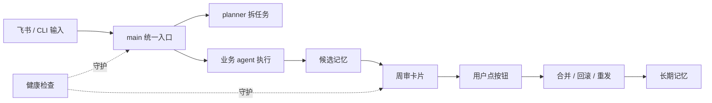

> 适合先读。把最近 OpenClaw 教程和模板里沉淀出来的新能力，整理成一张路线图：哪些已经能免费照着搭，哪些属于付费模板里的加速器。

---

## 新增了什么

最近新增内容围绕一个目标：让 OpenClaw 不只是“能聊天”，而是变成一个可以长期运行、能接企业 IM、能自检、能把记忆越用越干净的本地 AI 工作台。

| 能力 | 解决的问题 | 免费教程能做到什么 |
|---|---|---|
| 多模型中转与 fallback | 单一模型慢、贵、偶发不可用 | 配默认模型、兜底链、鉴权检查 |
| 多 agent 协作拓扑 | 一个 agent 什么都干，提示词越写越乱 | 拆 main / planner / executor / reflector |
| 共享记忆与周审 | agent 会忘、记忆文件越来越脏 | 建候选区、分层合并、定期回滚 |
| 飞书接入 | AI 只在终端里，团队用不起来 | 收消息、发卡片、群里协作 |
| 自定义交互卡片 | 只能“看报告”，不能点按钮执行 | 按钮携带 action，回调触发脚本 |
| 运维自检 | 升级、插件、权限一变就崩 | doctor、health check、smoke test |
| 安全交付 | 模板里容易混入个人密钥 | 占位符扫描、敏感文件隔离 |

这几类能力组合起来，就是一个可复制的闭环：

---

## 推荐搭建顺序

不要一上来就写复杂卡片。OpenClaw 的稳定性来自分层验证，每层都能单独回滚。

### 第 1 层：跑通本地 runtime

先完成：

- `openclaw setup`
- `openclaw gateway run`
- `openclaw chat main`
- `openclaw doctor`

对应章节：

- [安装](../01-入门/01-安装.md)
- [验证](../01-入门/03-验证.md)

判断标准：CLI 能和 main agent 正常对话，gateway 日志没有持续报错。

### 第 2 层：把“会话”变成“系统”

然后配置：

- `shared/`：团队规则、术语表、任务边界
- 多 agent：main 只路由，planner 只规划，业务 agent 只执行
- fallback models：主模型不可用时自动降级

对应章节：

- [基础配置](../01-入门/02-基础配置.md)
- [多 Agent 架构](../02-配置/00-多Agent架构.md)
- [协作拓扑](../03-多Agent/00-协作拓扑.md)

判断标准：你能明确说出“哪个 agent 负责什么”，而不是把所有规则塞进一个 prompt。

### 第 3 层：让记忆可审阅

接着做：

- 把原始记忆和候选记忆分开
- 按高价值、待审阅、低价值分层
- 每周生成 digest，由人确认再合并
- 合并后能回滚

对应章节：

- [记忆系统](../02-配置/01-记忆系统.md)
- [飞书周审卡片：从记忆候选到可点击审批](./02-飞书周审卡片.md)

判断标准：系统不会把所有聊天碎片都写进长期记忆，而是先进入候选区。

### 第 4 层：接入飞书，把 AI 放进工作流

飞书不要只当消息入口，更适合当“人机协作面板”：

- 文字消息：适合问答、派单、追问
- 卡片消息：适合报告、审批、二次确认
- 交互回调：适合触发合并、回滚、重发、打开配置引导

对应章节：

- [飞书深度配置](../02-配置/03-飞书深度配置.md)
- [飞书交互卡片入门](./01-飞书交互卡片入门.md)
- [飞书卡片回调处理器](./03-飞书卡片回调处理器.md)

判断标准：用户在飞书里点按钮，OpenClaw 能收到 action，并只执行白名单内的安全动作。

### 第 5 层：做运维闭环

最后补齐：

- gateway 健康检查
- 插件启停检查
- 日志轮转
- 卡片 dry-run
- handler 单元测试
- 升级前备份和升级后 smoke test

对应章节：

- [健康检查](../04-运维/00-健康检查.md)
- [日志与监控](../04-运维/01-日志与监控.md)
- [飞书卡片验证与排障](./04-飞书卡片验证与排障.md)

判断标准：你不需要等用户投诉才知道系统坏了。

---

## 免费文档和付费模板的边界

免费文档会尽量讲清楚“为什么这样设计”和“怎么自己做出来”：

- 架构拆分方法
- 配置位置和验证命令
- 飞书卡片的数据流
- handler 的安全边界
- 常见坑和排障路径

付费模板主要节省时间：

- 去个性化后的配置骨架
- 可直接改占位符的脚本模板
- 安装器和 smoke test
- 多 agent shared 规范模板
- 周审卡片、合并、回滚的完整实现骨架

如果你愿意自己写代码，免费文档足够搭出同类系统；如果你想少走弯路，模板是加速器。

---

## 最小可复刻清单

想跟着 AI 一步步做，建议把任务拆成 6 个 prompt，不要一次让 AI 生成全部：

1. “根据我的业务，帮我设计 OpenClaw 的 main / planner / worker / reflector 职责边界。”
2. “帮我写 shared 目录的规则文件，要求可被多个 agent 读取。”
3. “帮我设计一个记忆候选 Markdown 格式，分高价值、待审阅、低价值三层。”
4. “帮我生成一张飞书 CardKit 2.0 审阅卡片，只包含统计、明细折叠区和三个按钮。”
5. “帮我写一个只接受白名单 action 的回调 handler，按钮 value 里必须带 task_id 和 issued_at。”
6. “帮我写 dry-run、日志和回滚流程，先不接真实飞书 API。”

每一步都先在本地 dry-run，再接真实飞书。这样最稳。

---

## 下一步

如果你是第一次做飞书卡片，从 [飞书交互卡片入门](./01-飞书交互卡片入门.md) 开始；如果你已经有飞书 bot，直接看 [飞书周审卡片](./02-飞书周审卡片.md)。
