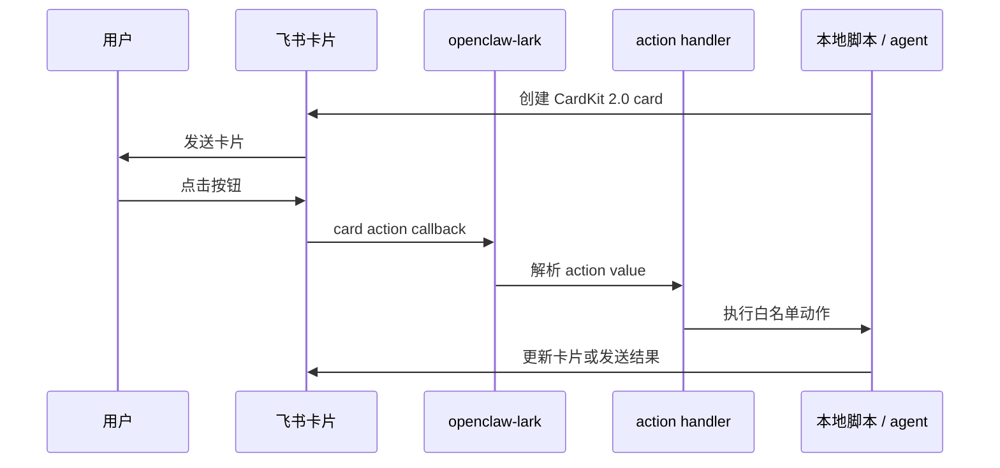

> 目标：用 OpenClaw + 飞书做一张“能看、能点、能回调”的自定义交互卡片。先不追求复杂业务，先把最小闭环跑通。

---

## 你要做出来的东西

普通飞书消息只能展示文字；交互卡片可以把 AI 的输出变成一个小型工作台：

- 顶部显示任务摘要
- 中间展示 AI 整理的结果
- 底部放按钮：确认、重试、取消、打开配置
- 用户点击后，飞书把 action 回调给 OpenClaw
- OpenClaw 根据 action 执行脚本或派给 agent

最小链路是这样：



---

## 为什么推荐 CardKit 2.0

飞书历史上有多种卡片格式。做 OpenClaw 场景时，推荐优先使用 CardKit 2.0，原因是：

| 能力 | 为什么重要 |
|---|---|
| `card_id` | 先创建卡片实体，再发送，后续可以更新同一张卡 |
| 更强布局 | 可做列布局、折叠面板、表单、按钮组 |
| 交互值更清晰 | 按钮 `value` 可以携带结构化 JSON |
| 更适合审阅流 | 审阅前、合并中、合并完成、回滚确认都能复用同一张卡 |

如果你的目标只是发一条通知，普通消息够用；如果你要做审批、周报、运维面板，直接上 CardKit 2.0。

---

## 最小卡片结构

一张可用卡片至少包含 4 层信息：

```json
{
  "schema": "2.0",
  "config": { "update_multi": true },
  "header": {
    "title": { "tag": "plain_text", "content": "OpenClaw 任务审阅" },
    "template": "blue"
  },
  "body": {
    "elements": [
      {
        "tag": "markdown",
        "content": "本次发现 3 条候选，请选择处理方式。"
      },
      {
        "tag": "button",
        "text": { "tag": "plain_text", "content": "确认执行" },
        "type": "primary",
        "value": {
          "action": "demo-confirm",
          "task_id": "demo-20260424-001",
          "issued_at": 1777046400
        }
      }
    ]
  }
}
```

重点不是样式，而是按钮的 `value`。它是后端 handler 判断“用户点了什么”的唯一可信业务载荷。

---

## 按钮 value 设计原则

不要只传一个字符串，例如 `"ok"`。建议始终传结构化对象：

| 字段 | 必填 | 用途 |
|---|---:|---|
| `action` | 是 | 白名单动作名，例如 `memory-merge-selected` |
| `task_id` | 是 | 本次卡片对应的任务批次 |
| `issued_at` | 是 | 卡片生成时间，用来判断过期 |
| `tier` | 否 | 高价值 / 待审阅 / 低价值等分层 |
| `hashes` | 否 | 只处理用户选中的条目 |
| `card_meta` | 否 | 卡片级元信息，避免 handler 再猜上下文 |

推荐格式：

```json
{
  "action": "memory-merge-selected",
  "task_id": "weekly-2026-04-24",
  "tier": "high",
  "hashes": ["aaaabbbbcccc", "ddddeeeeffff"],
  "card_meta": {
    "kind": "weekly-memory-digest",
    "issued_at": 1777046400,
    "expires_in_sec": 604800
  }
}
```

---

## OpenClaw 侧最小目录建议

先用脚本把闭环跑通，再把动作交给 agent：

```text
~/.openclaw/
  scripts/
    send-demo-card.py
    handle-demo-action.py
  logs/
    card-actions.jsonl
  temp/
    cards/
      demo-20260424-001.json
```

建议先让 `send-demo-card.py --dry-run` 打印 JSON，不直接发飞书。确认 JSON 合法后，再接真实 API。

---

## 和 AI 协作的 prompt 模板

你可以让 AI 先生成卡片 JSON，但要明确边界：

```text
帮我生成一张飞书 CardKit 2.0 JSON 卡片，用于 OpenClaw 任务审阅。
要求：
1. schema 使用 2.0。
2. 顶部有标题和摘要。
3. body 里有 markdown 明细和 3 个按钮：确认、重试、取消。
4. 每个按钮 value 都必须是对象，包含 action、task_id、issued_at。
5. 不要写真实 app_id、app_secret、open_id。
6. 输出前检查 JSON 是否可被 json.loads 解析。
```

然后再让 AI 写发送脚本：

```text
基于这张卡片 JSON，帮我写 Python 发送脚本。
要求：
1. 支持 --dry-run。
2. app_id、app_secret、receive_id 从环境变量读取。
3. 使用 CardKit 2.0：先创建 card，再发送 card_id。
4. 所有失败都打印 stage、status、response body。
5. 不要把密钥写入日志。
```

---

## 先做 dry-run

第一阶段只验证三件事：

```bash
python3 ~/.openclaw/scripts/send-demo-card.py --dry-run
python3 -m json.tool /tmp/demo-card.json >/dev/null
wc -c /tmp/demo-card.json
```

建议卡片 JSON 控制在 30KB 以内。真实项目里，明细过多时应该折叠或只展示摘要，避免飞书接口拒绝。

---

## 接入真实飞书前的检查

确认这些都通过再发：

- 飞书应用已开启机器人能力
- 权限包含发消息和卡片相关能力
- 事件订阅 URL 已验证通过
- `openclaw-lark` 和官方 `feishu` 插件不要同时启用
- OpenClaw gateway 外网可达，或你已经配置内网穿透 / Tailscale / 反向代理
- 日志里不会打印 appSecret、tenant token、用户 open_id 全量信息

更详细配置见 [飞书深度配置](../02-配置/03-飞书深度配置.md)。

---

## 下一步

跑通最小卡片后，继续看 [飞书周审卡片](./02-飞书周审卡片.md)，把“按钮”变成真正可审阅、可合并、可回滚的 OpenClaw 记忆工作流。
