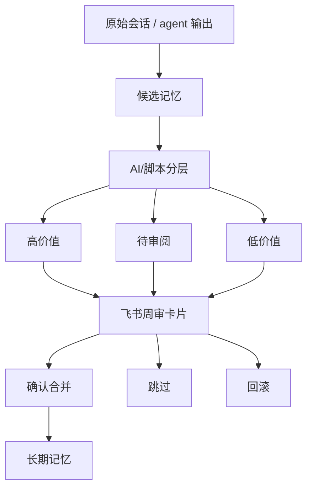
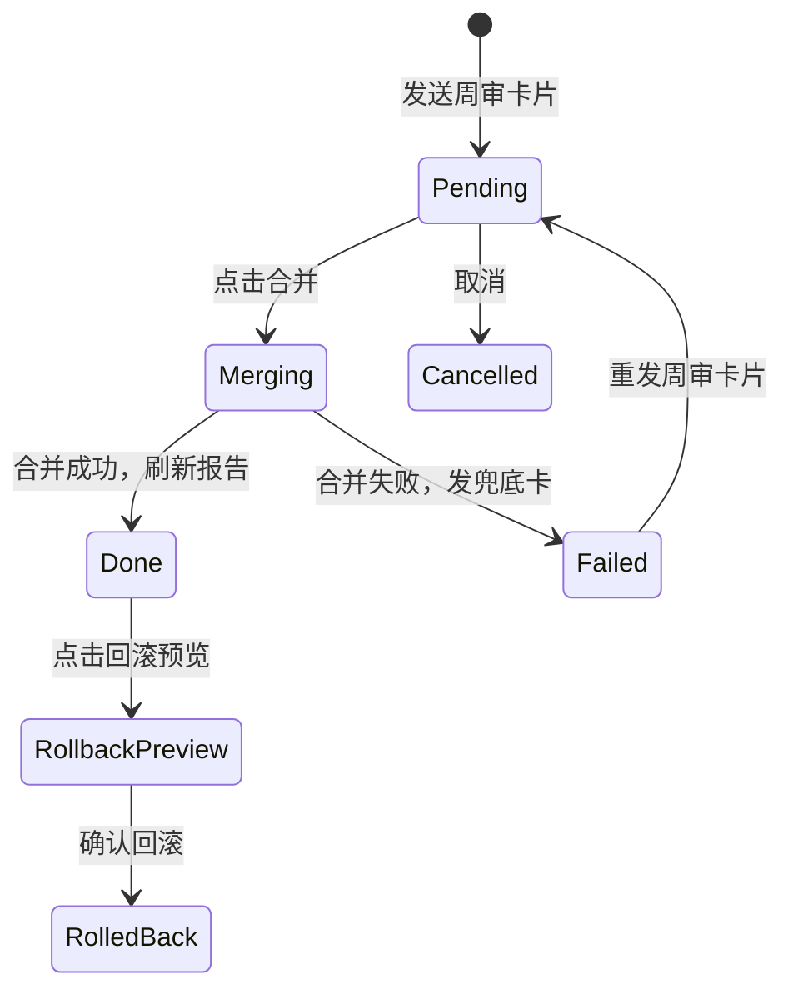

> 目标：把 OpenClaw 一周产生的记忆候选，整理成一张飞书卡片，让人点击按钮完成合并、跳过、回滚或重发。

---

## 为什么需要周审卡片

OpenClaw 长期运行后，最大的问题不是“没有记忆”，而是“什么都记”：

- 临时对话进入长期记忆
- 重复事实越积越多
- 子 agent 的过程性输出污染共享规则
- 错误结论没有退出机制

周审卡片的作用，是把“自动记忆”改成“AI 整理 + 人类确认”：



---

## 推荐的候选格式

用 Markdown 做中间态最容易调试。建议按层级分区，每条带稳定 hash：

```markdown
## 🟢 高价值候选（2）

### `aaaabbbbcccc` [main] 客户偏好：飞书优先
- 内容：用户团队主要在飞书协作，AI 通知优先发飞书。
- 来源：2026-04-24 main session
- 建议：写入 shared/profile.md

## 🟡 待审阅候选（1）

### `ddddeeeeffff` [planner] 运营流程假设
- 内容：每周一上午适合发运营复盘。
- 风险：可能只是临时安排。

## 📦 低价值候选（3）

### `111122223333` [worker] 临时排障命令
- 内容：一次性端口检查命令。
```

hash 的好处：按钮可以只提交选中的 hash，合并脚本也能去重。

---

## 周审卡片应该显示什么

不要把所有内容平铺出来。推荐结构：

| 区域 | 内容 | 设计原因 |
|---|---|---|
| Header | 本周记忆周审、日期、状态颜色 | 一眼知道卡片用途 |
| Preamble | 高价值 / 待审阅 / 低价值数量 | 先看总量 |
| 热门主题 | 高频关键词或业务主题 | 快速判断本周重点 |
| 折叠明细 | 每层展示前 N 条 | 控制卡片长度 |
| 操作区 | 合并高价值、合并全部、取消、回滚 | 让人能直接处理 |
| Footer | task_id、生成时间、过期提示 | 方便排障和审计 |

---

## 按钮动作设计

建议从少量动作开始：

| action | 用途 | 是否危险 |
|---|---|---:|
| `memory-merge-high` | 只合并高价值候选 | 中 |
| `memory-merge-selected` | 合并用户选中的 hash | 中 |
| `memory-merge-all` | 合并全部候选 | 高 |
| `memory-rollback-preview` | 生成回滚预览 | 低 |
| `memory-rollback-confirm` | 确认回滚 | 高 |
| `cancel` | 关闭或标记取消 | 低 |
| `git-setup` | 打开 Git 备份引导 | 低 |

危险动作必须二次确认，尤其是 `merge-all` 和 `rollback-confirm`。

---

## 卡片状态流转

一张好用的周审卡片不是“发出去就结束”，而是会更新状态：



实现上建议保存一个 state 文件：

```json
{
  "task_id": "weekly-2026-04-24",
  "card_id": "AAq...",
  "message_id": "om_...",
  "candidates_path": "~/.openclaw/memory/candidates.md",
  "issued_at": 1777046400
}
```

后续 handler 不要靠“猜最近一张卡”，而是根据 `task_id` 找 state。

---

## 合并脚本的安全要求

记忆合并是会改变长期状态的动作，至少要满足：

- 支持 `--dry-run`，先打印将要合并的条目
- 合并前备份目标记忆文件
- 根据 hash 去重，避免重复写入
- 每次合并写审计日志
- 支持按 tier 回滚
- 失败时不删除候选文件
- 卡片刷新失败时，另发一张兜底结果卡

推荐命令形态：

```bash
python3 ~/.openclaw/scripts/memory-merge-weekly.py --dry-run --tier high
python3 ~/.openclaw/scripts/memory-merge-weekly.py --tier high
python3 ~/.openclaw/scripts/memory-merge-weekly.py --rollback --dry-run --tier high
```

---

## 让 AI 帮你生成第一版

可以把需求拆成三次给 AI：

```text
第一步：帮我设计 weekly memory candidates 的 Markdown 格式。
要求分为高价值、待审阅、低价值三层，每条都有 hash、agent、标题、内容、来源、建议目标文件。
```

```text
第二步：帮我写 Python 脚本，把 candidates.md 解析成 JSON 统计。
要求支持 --dry-run，不写入任何文件；解析失败时指出行号。
```

```text
第三步：基于这个 JSON 统计生成飞书 CardKit 2.0 周审卡片。
要求按钮 value 包含 action、task_id、tier、hashes、card_meta；卡片超过 30KB 时自动折叠明细。
```

不要让 AI 一步到位写“解析 + 发卡 + 回调 + 合并 + 回滚”。拆开做更容易测。

---

## 真实系统里的增强点

本教程推荐的增强点包括：

- **热门主题**：候选数量较多时，顶部显示重复出现的关键词
- **卡片过期**：超过有效期后按钮不再执行危险动作
- **Git 引导**：检测长期记忆目录没有 Git 备份时，提示先启用备份
- **三列布局**：高价值 / 待审阅 / 低价值并排展示统计
- **兜底报告**：主卡片刷新失败时，发送一张新的结果卡，避免用户不知道动作是否成功

这些不是第一天必须做，但生产环境非常有用。

---

## 下一步

卡片发出去之后，关键在回调处理。继续看 [飞书卡片回调处理器](./03-飞书卡片回调处理器.md)。
