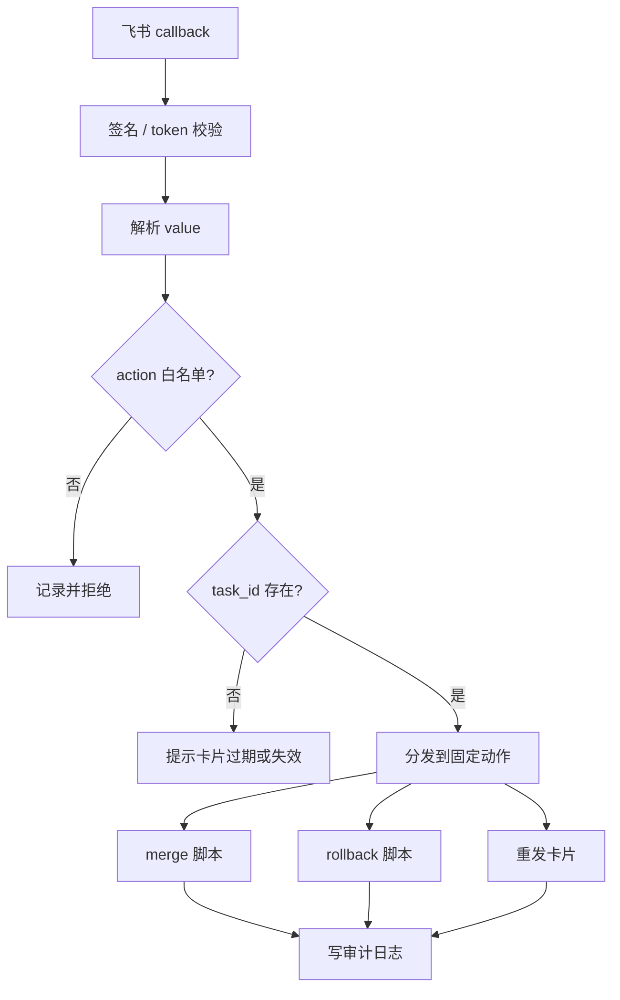

> 目标：让飞书卡片按钮真正驱动 OpenClaw，但只执行你允许的动作，不把回调入口变成任意命令执行入口。

---

## 回调处理器负责什么

卡片按钮点击后，飞书会把事件发给你的机器人回调地址。OpenClaw 侧通常由 `openclaw-lark` 接住事件，再交给一个 handler 判断要做什么。

handler 不应该“很聪明”。它只做 5 件事：

1. 校验事件来源和签名
2. 解析按钮 `value`
3. 检查 action 是否在白名单
4. 检查卡片是否过期、task_id 是否存在
5. 调用固定脚本或固定 agent 动作

不要让 handler 根据用户传入的字符串拼 shell 命令。

---

## 推荐数据流



---

## action 白名单

先定义一张白名单表，而不是在代码里到处写 `if`：

```json
{
  "memory-merge-high": {
    "command": "memory-merge-weekly.py",
    "args": ["--tier", "high"],
    "dangerous": true,
    "confirm_required": false
  },
  "memory-rollback-preview": {
    "command": "memory-merge-weekly.py",
    "args": ["--rollback", "--dry-run"],
    "dangerous": false,
    "confirm_required": false
  },
  "memory-rollback-confirm": {
    "command": "memory-merge-weekly.py",
    "args": ["--rollback"],
    "dangerous": true,
    "confirm_required": true
  },
  "cancel": {
    "command": "noop",
    "dangerous": false,
    "confirm_required": false
  }
}
```

真实实现可以写在 JS/TS 对象里，也可以放 JSON 配置。关键是：用户回调只能选择这张表里的动作。

---

## handler 的伪代码

下面是结构示意，不依赖具体插件版本：

```javascript
const ALLOWED_ACTIONS = new Map([
  ['memory-merge-high', { script: 'memory-merge-weekly.py', args: ['--tier', 'high'] }],
  ['memory-rollback-preview', { script: 'memory-merge-weekly.py', args: ['--rollback', '--dry-run'] }],
  ['cancel', { script: null, args: [] }],
]);

export async function handleCardAction(event) {
  const value = event?.action?.value;
  const action = value?.action;

  if (!ALLOWED_ACTIONS.has(action)) {
    return reject('unknown_action', { action });
  }

  const taskId = value?.task_id;
  const state = await loadState(taskId);
  if (!state) {
    return reject('unknown_task', { taskId });
  }

  if (isExpired(value?.card_meta?.issued_at, value?.card_meta?.expires_in_sec)) {
    return reject('expired_card', { taskId });
  }

  await appendAuditLog({ action, taskId, operator: event.operator, ts: Date.now() });
  return dispatch(ALLOWED_ACTIONS.get(action), value, state);
}
```

生产实现还要加签名校验、异常捕获、超时控制和日志脱敏。

---

## 调用脚本的原则

handler 调脚本时，参数必须来自白名单和经过校验的字段：

可以：

```text
memory-merge-weekly.py --tier high
memory-merge-weekly.py --rollback --dry-run --tier review
```

不要：

```text
memory-merge-weekly.py ${event.action.value.raw_args}
sh -c ${event.action.value.command}
```

如果需要传 hash 列表，建议写入临时 JSON 文件，再把文件路径传给脚本：

```bash
python3 memory-merge-weekly.py --include-hashes-file /tmp/openclaw-card-action-xxx.json
```

这样比把长数组拼进命令行更容易审计。

---

## 审计日志格式

每次点击都写一行 JSONL：

```json
{"ts":"2026-04-24T10:15:00+08:00","action":"memory-merge-high","task_id":"weekly-2026-04-24","operator":"ou_xxx","result":"accepted"}
```

建议记录：

| 字段 | 用途 |
|---|---|
| `ts` | 排障排序 |
| `action` | 用户点了哪个按钮 |
| `task_id` | 对应哪张卡 |
| `operator` | 谁点的，注意脱敏 |
| `result` | accepted / rejected / failed |
| `reason` | 拒绝或失败原因 |
| `card_id` | 后续更新卡片 |

不要记录完整 token、appSecret、原始 headers。

---

## 过期卡片怎么处理

卡片过期后，危险动作应该拒绝，但可以给用户一个温和提示：

- “这张周审卡片已过期，请回复 `重发周审卡片`。”
- “本次合并状态已变化，请打开最新卡片操作。”
- “回滚窗口已关闭，请在终端执行 dry-run 后人工确认。”

过期策略建议：

| 动作 | 过期后 |
|---|---|
| 查看详情 | 可以允许 |
| 重发卡片 | 可以允许 |
| 合并记忆 | 拒绝 |
| 回滚 | 拒绝或要求管理员确认 |
| 取消 | 可以允许，但只更新 UI |

---

## 和 agent 协作的边界

有些动作可以派给 AI，有些不应该。

适合交给 agent：

- 总结本周主题
- 解释某条候选为什么进入高价值
- 生成合并后的自然语言报告
- 帮用户定位失败日志

不适合直接交给 agent：

- 删除长期记忆文件
- 执行任意 shell
- 修改 OpenClaw 主配置
- 绕过二次确认做回滚

规则很简单：AI 可以“建议”，状态变更必须走脚本和白名单。

---

## AI 生成 handler 的 prompt

```text
帮我写一个飞书卡片 action handler。
要求：
1. 输入是飞书回调事件 JSON。
2. 只允许处理白名单 action：memory-merge-high、memory-rollback-preview、cancel。
3. value 必须包含 action、task_id、card_meta.issued_at。
4. 卡片超过 7 天拒绝危险动作。
5. 不允许使用 sh -c，不允许执行用户传入的 command。
6. 每次处理都写 JSONL 审计日志，敏感字段脱敏。
7. 给出 8 个单元测试 case。
```

如果 AI 生成了 `eval`、`exec(raw)`、`sh -c`，直接让它重写。

---

## 下一步

handler 写完后，不要急着上线。继续看 [飞书卡片验证与排障](./04-飞书卡片验证与排障.md)，先用模拟 callback 把每个 action 跑一遍。
