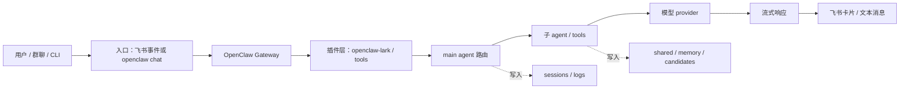
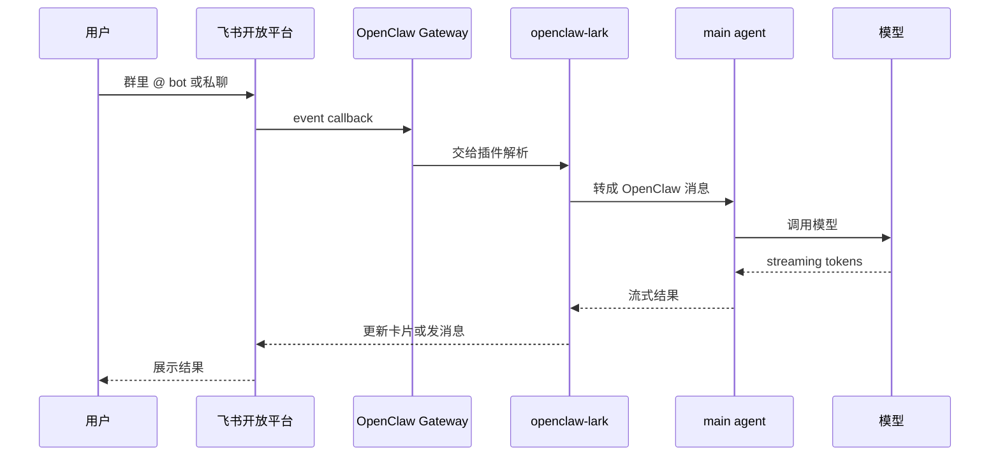
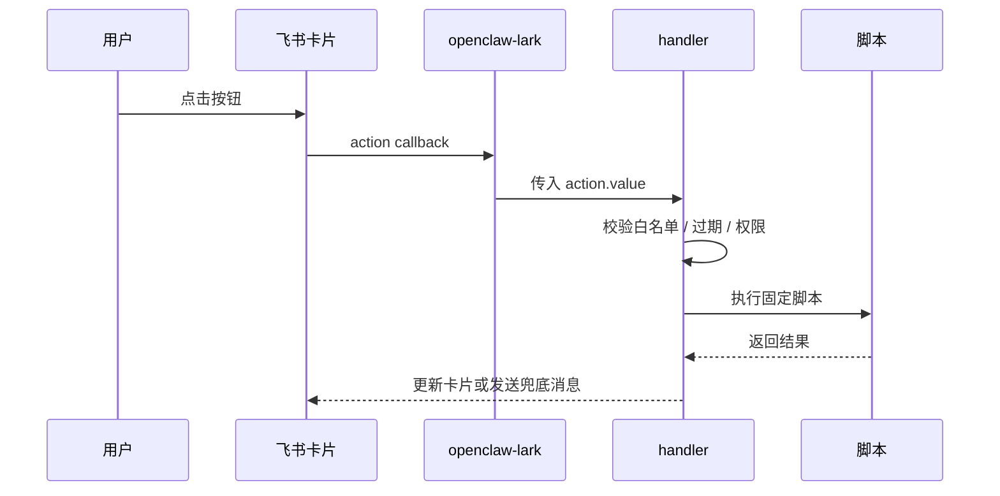

> 目标：理解一条消息从飞书或 CLI 进入 OpenClaw 后，经过哪些模块、写哪些日志、哪里最容易出错。

---

## 总链路



排障时要先定位失败发生在哪一段，而不是一上来就改配置。

---

## CLI 消息链路

```bash
openclaw chat main
```

大致流程：

1. CLI 读取当前 agent 配置
2. 连接本地 gateway 或直接进入 agent runtime
3. main agent 读取 shared 和 session
4. 根据模型配置发起请求
5. 流式输出回终端
6. 写 session、日志和可能的记忆候选

CLI 能跑通，说明模型和基本 agent 配置大概率没问题；飞书还不通时，就重点查插件、事件订阅和外网回调。

---

## 飞书消息链路

飞书多了三段：开放平台、回调网络、插件适配。



如果 CLI 正常但飞书无响应，优先看：

- 飞书事件是否打到 gateway
- gateway 是否把事件交给插件
- 插件是否识别 chat_id / open_id
- bot 是否有发消息权限

---

## 卡片交互链路

卡片按钮和普通消息不同：它不是 `im.message.receive_v1`，而是 card action callback。



普通消息能收到，不代表按钮能收到；两者在飞书开放平台里的配置项不同。

---

## 关键日志

建议先按这个顺序看：

| 日志 | 用途 |
|---|---|
| `~/.openclaw/logs/gateway.log` | 正常请求、插件加载、事件流 |
| `~/.openclaw/logs/gateway.err.log` | 异常栈、权限错误、启动失败 |
| `~/.openclaw/logs/card-actions.jsonl` | 卡片按钮点击审计 |
| `~/.openclaw/logs/weekly-memory-digest.log` | 周审卡片生成过程 |
| `~/.openclaw/logs/memory-merge-weekly.log` | 合并 / 回滚过程 |

如果日志没有任何飞书事件，说明请求没进 gateway；如果 gateway 有事件但没有 agent 响应，说明插件或路由层出问题。

---

## 最常见断点

| 断点 | 现象 | 先查 |
|---|---|---|
| 飞书没打到 gateway | 日志完全没事件 | 回调 URL / 代理 / 证书 |
| gateway 收到但校验失败 | 401 / signature error | appSecret / encrypt key |
| 插件没处理 | 有 event，无回复 | 插件 enabled / 冲突 |
| agent 没响应 | 插件转发后停住 | agent 配置 / 模型鉴权 |
| 模型报错 | 有 provider error | `models status` |
| 卡片更新失败 | 文本成功、卡片失败 | CardKit 权限 / card_id |
| 按钮无效 | 卡片能发，点击没反应 | card action callback |

---

## 一条消息的最小排查命令

```bash
openclaw doctor
openclaw gateway status
openclaw models status --json
 tail -n 120 ~/.openclaw/logs/gateway.err.log
 tail -n 120 ~/.openclaw/logs/gateway.log
```

如果是飞书卡片：

```bash
 tail -n 80 ~/.openclaw/logs/card-actions.jsonl 2>/dev/null || true
```

注意：复制日志给 AI 前先脱敏。

---

## 用 AI 帮你定位断点

```text
我在排查 OpenClaw Gateway 消息链路。
我会给你三段脱敏日志：gateway.log、gateway.err.log、card-actions.jsonl。
请按入口、插件、agent、模型、卡片回复五层判断失败断点，并给下一步命令。
不要让我提供完整 token、appSecret 或 open_id。
```
