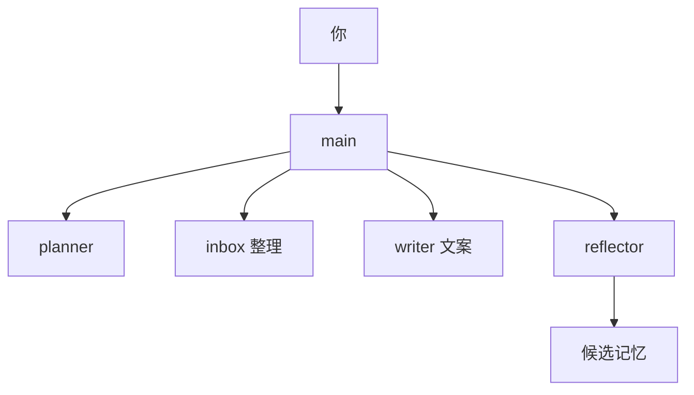
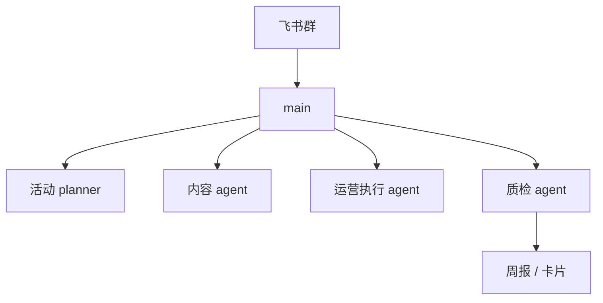
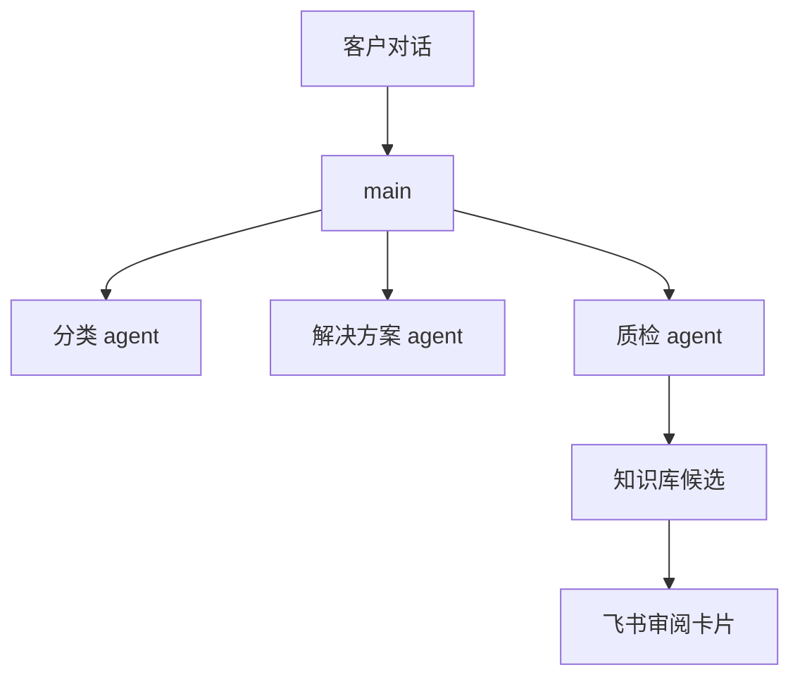

> 目标：用几个可复制的案例说明 OpenClaw 多 agent 应该怎么拆。重点是职责边界，不是把所有 prompt 都塞进免费文档。

---

## 设计原则

多 agent 不是“越多越高级”。拆分前先问 4 个问题：

1. 这个角色是否有稳定职责？
2. 它是否需要不同模型或工具权限？
3. 它的输出是否能被另一个 agent 审核或复用？
4. 拆出来后是否降低 main 的复杂度？

如果答案都是否，就不要拆。

---

## 通用四角色

多数 OpenClaw 系统从这 4 个角色开始就够用：

| agent | 职责 | 不该做什么 |
|---|---|---|
| main | 统一入口、判断意图、分派任务 | 不长期写复杂业务逻辑 |
| planner | 拆任务、列风险、给执行计划 | 不直接改文件 / 发消息 |
| worker | 执行具体任务 | 不改全局规则 |
| reflector | 整理记忆、复盘、生成候选 | 不直接把候选写入长期记忆 |

边界越清晰，后期越容易排障。

---

## 案例 1：个人 AI 助理

适合个人知识管理、日程整理、资料归档。



推荐职责：

| agent | 职责 |
|---|---|
| main | 判断是问答、整理、写作还是排障 |
| inbox | 整理输入材料，提取待办和事实 |
| writer | 写邮件、文章、飞书消息 |
| reflector | 每天或每周整理记忆候选 |

不要一开始就做 10 个角色。个人系统最怕维护成本高于收益。

---

## 案例 2：运营团队助手

适合社群运营、内容排期、活动复盘。



推荐职责：

| agent | 职责 |
|---|---|
| planner | 拆活动计划、列风险和资源 |
| content | 生成推文、海报文案、群公告 |
| ops | 跟进 checklist、生成执行提醒 |
| qa | 检查口径一致、风险词、遗漏项 |

飞书卡片适合放在这里：活动审批、周报确认、素材发布前确认。

---

## 案例 3：客服质检助手

适合把客户对话变成知识库和改进建议。



推荐职责：

| agent | 职责 |
|---|---|
| classifier | 判断问题类型、紧急程度、是否已有 SOP |
| resolver | 草拟回复或解决步骤 |
| qa | 检查回复是否越权、是否遗漏关键步骤 |
| reflector | 把高频问题整理成知识库候选 |

注意：客服场景不要让 AI 自动承诺退款、赔偿、法律责任，必须走人工确认。

---

## 工具权限怎么分

不要所有 agent 都能用所有工具。建议：

| 工具类型 | 谁可以用 |
|---|---|
| 只读搜索 / 读取文档 | main、planner、worker |
| 写文件 / 改配置 | worker，且需明确任务 |
| 发飞书消息 | main 或 notifier |
| 合并记忆 | reflector 生成候选，脚本执行合并 |
| 回滚 / 删除 | 只允许脚本 + 二次确认 |

如果工具权限给太宽，出了问题很难判断是谁改的。

---

## shared 文件建议

最小 shared 结构：

```text
shared/
  roles.md          # 每个 agent 的职责边界
  glossary.md       # 业务术语
  style-guide.md    # 输出风格
  safety.md         # 禁止事项和升级规则
  workflow.md       # 常用流程
```

把稳定规则写进 shared，不要每次都塞进用户 prompt。

---

## 让 AI 帮你设计职责

```text
我想用 OpenClaw 搭一个多 agent 系统，业务是【填写你的业务】。
请帮我设计 main、planner、worker、reflector 的职责边界。
要求：
1. 每个 agent 只列 5 条以内职责。
2. 每个 agent 都要写“不该做什么”。
3. 给出工具权限建议。
4. 给出 shared/roles.md 的草稿。
5. 不要生成完整安装模板。
```
