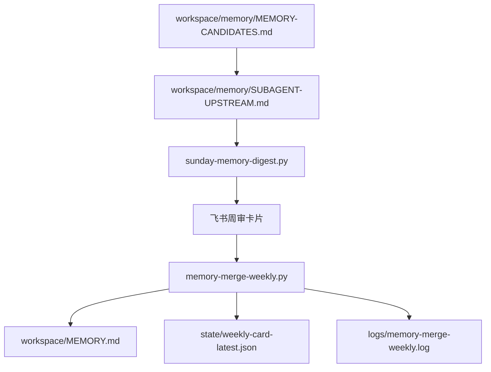

> 预计阅读：12 分钟
> 适用版本：OpenClaw 2026.4.14+ · 最后审核：2026-04-25
> 前置：[02-配置/01-记忆系统](../02-配置/01-记忆系统.md) / [07-实战/02-飞书周审卡片](./02-飞书周审卡片.md)
> 目标：把“候选记忆生成 → 周审摘要 → 卡片触发 → 合并 / 回滚”这条完整链路串起来，而不是只看单个脚本

---

## 这条链真正解决的问题

很多人以为记忆系统的核心是“多记一点”。  
实际长期运行后，真正棘手的是另外两件事：

1. 什么都记，长期记忆越来越脏
2. 想回滚时，没有一条稳定、可审阅、可撤销的链

所以现在更推荐的做法不是“自动把所有候选写进 MEMORY.md”，而是：

```text
先生成候选
  ↓
先做分层审阅
  ↓
再由人点按钮确认
  ↓
最后才真正合并
```

---

## 整条链的主要文件



这几份文件里，真正最重要的是 3 份：

- `MEMORY-CANDIDATES.md`
- `SUBAGENT-UPSTREAM.md`
- `MEMORY.md`

前两份是审阅层，最后一份才是长期记忆层。

---

## 第一步：先生成候选记忆

候选生成脚本的目标不是“自动合并”，而是“把值得看的一批东西筛出来”。

当前候选主要来自 4 个来源：

| 来源 | 在看什么 |
|---|---|
| LanceDB 高重要度记录 | 最近几天里 importance 很高的记忆条目 |
| 每日日志标题 | 里程碑、决策、固化、迁移这类标题 |
| 配置文件变更 | `openclaw.json`、`agents/*/models.json` 的 mtime 是否新于 `MEMORY.md` |
| 子 agent 的 `MEMORY.md` | 子 agent 已有、但 main 还没吸收的章节 |

也就是说，候选层不是只有对话内容，它也会把“配置变化”和“子 agent 稳定经验”往上提。

---

## 候选层为什么要有 hash

现在候选条目通常都会带一个短 hash，例如：

```text
- [ ] `abc123def456` — 某条候选
```

这个 hash 主要做三件事：

1. 幂等  
   同一条内容不会因为脚本重复执行而无限追加
2. 审阅  
   你可以显式把某条候选标成忽略
3. 回溯  
   卡片动作、合并日志和周审状态都能指回这条候选

这比只靠“标题字符串去重”可靠得多。

---

## 第二步：允许人工忽略，不要每周重复骚扰

候选文件里如果你把一条标成：

```text
- [x] `abc123def456` ...
```

脚本会把这个 hash 记进状态文件，后续不再重复推这条。

这一步非常关键，因为长期系统里最耗人的不是“没有候选”，而是“已经明确不要了还反复出现”。

换句话说，**忽略机制本身就是记忆系统的一部分**。

---

## 第三步：从候选变成“上卷建议”

只靠 `MEMORY-CANDIDATES.md` 还不够，因为它更像原材料池。  
往上一步，通常还会生成：

```text
workspace/memory/SUBAGENT-UPSTREAM.md
```

这层的作用是做“建议上卷版”。

常见分层包括：

- `🟢 强烈建议上卷`
- `🟡 可考虑上卷`
- 候选层的 `🔥 / 📋 / 📦`

这里最大的价值不是再分类一次，而是把“原始候选”改写成更适合写进长期记忆的表达。

---

## 第四步：周审摘要和卡片只是“审阅界面”

到了 `sunday-memory-digest.py` 和飞书卡片这一层，重点已经不是生成新内容，而是提供一个**人能快速确认的审阅界面**。

它通常会把：

- 候选层摘要
- 上卷建议
- 操作按钮
- 回滚 / 重发入口

收成一张可点击卡片。

这也是为什么前面几篇 07 章节一直强调：

- 卡片不是逻辑本体
- 按钮只是动作入口
- 真正改变长期状态的还是合并脚本

---

## 第五步：真正改长期记忆的是 `memory-merge-weekly.py`

这一步才会实际改：

```text
~/.openclaw/workspace/MEMORY.md
```

当前这条脚本最重要的行为是：

1. 追加而不是重写  
   默认 append 一个新的 `## 周合并 YYYY-MM-DD` section
2. 幂等  
   同一天、同 tier 不重复追加
3. 支持 dry-run  
   先看要写什么，再决定是否执行
4. 支持 rollback  
   可以撤销最近一次周合并

这意味着它的设计目标不是“帮你自动美化 MEMORY.md”，而是“安全落地本周确认过的内容”。

---

## 当前常见的 tier

合并脚本通常支持这些档位：

- `green`
- `high`
- `all`
- `rollback`

可以理解成：

- `green`：优先收已经改写过、强烈建议上卷的内容
- `high`：收高优先候选
- `all`：一起收
- `rollback`：撤回最近一次周合并

所以生产里更稳的做法通常是先从 `green` 或 `high` 开始，而不是默认 `all`。

---

## 回滚为什么一定要保留

记忆合并和普通日志不同，它会改变之后的长期推理。  
一旦把错误规则、过期事实或临时情绪写进 `MEMORY.md`，后面的 agent 可能会反复引用。

所以当前这条链才会把“rollback”当成一等公民，而不是额外附赠。

回滚的价值在于：

- 审阅判断错了能撤回
- 上游改写质量不稳定时有后手
- 卡片动作误触发时有恢复路径

如果一条记忆链没有回滚，就不适合长期自动化。

---

## 最小安全推进顺序

如果你第一次搭这条链，建议按这个顺序推进：

```bash
# 1. 先生成候选
python3 ~/.openclaw/scripts/memory-candidates.py

# 2. 再看上卷建议
python3 ~/.openclaw/scripts/subagent-upstream-advisor.py --dry-run

# 3. 再看周审摘要
python3 ~/.openclaw/scripts/sunday-memory-digest.py --dry-run --json

# 4. 再做合并自检
python3 ~/.openclaw/scripts/memory-merge-weekly.py --self-test

# 5. 先 dry-run 合并
python3 ~/.openclaw/scripts/memory-merge-weekly.py --dry-run --tier high

# 6. 最后才真正合并
python3 ~/.openclaw/scripts/memory-merge-weekly.py --tier high
```

不要跳过 dry-run。  
尤其不要还没确认候选格式，就直接把按钮接到真实合并。

---

## 这条链为什么最好放在 Git 仓里

当前合并脚本会优先利用 workspace 的 Git 兜底能力。原因很现实：

- 长期记忆是会变的
- 回滚不仅是“删掉一段文本”
- 你还需要知道这次周合并之前和之后到底差了什么

如果 `workspace/` 根本不在 Git 里，那 rollback 只能退化成“文本层面的最近段删除”，可追溯性会差很多。

所以公开文档里现在更推荐：

- 候选层可以是脚本产物
- 长期记忆层最好有 Git 备份

---

## 两个很容易忽略的安全点

### 1. 先审阅，再执行

飞书卡片按钮可以很方便，但也更容易造成“看都没看就点了”。  
真正稳妥的流程是：

- 先读候选和改写版
- 再触发合并
- 合并后再抽看 `MEMORY.md`

### 2. 过期卡片不要继续执行危险动作

周审卡片本质上是带状态的操作入口。  
过期卡片如果还能直接触发 merge / rollback，等于让历史界面控制当前状态。

---

## 常见坑

### 坑 1：把候选层当长期记忆

`MEMORY-CANDIDATES.md` 是审阅池，不是最终记忆。  
如果你直接拿它当长期记忆读，噪声会非常大。

### 坑 2：没有忽略机制

没有 dismiss hash 的链路，几周后一定会被重复候选拖垮。

### 坑 3：没有 dry-run 就接飞书按钮

这样一旦参数拼错、tier 选错或 hash 列表有问题，按钮就是直接改长期状态。

### 坑 4：没有日志和状态文件

合并链出问题时，至少应该能看：

- `memory-merge-weekly.log`
- 最近一张周审状态记录
- 对应卡片动作参数

不然你只知道“点了没效果”，不知道到底卡在哪一步。

---

## 红线：不要这样做周合并

### ❌ 不要跳过人工确认

记忆系统的目标是长期稳定，不是短期自动化炫技。

### ❌ 不要直接覆盖整个 `MEMORY.md`

现在更安全的策略是 append 新 section，再逐步整理。

### ❌ 不要只有 merge 没有 rollback

没有回滚的长期状态变更，不适合交给按钮执行。

### ❌ 不要把卡片 UI 当逻辑本体

卡片只是入口。真正要稳的是候选、改写、合并和状态落盘。

---

## 验证清单

| 检查项 | 怎么验 |
|---|---|
| 候选能生成 | `memory-candidates.py` 能写出 `MEMORY-CANDIDATES.md` |
| 上卷建议能生成 | `subagent-upstream-advisor.py --dry-run` 可执行 |
| 周审摘要能生成 | `sunday-memory-digest.py --dry-run --json` 可执行 |
| 合并链自检通过 | `memory-merge-weekly.py --self-test` 返回 0 |
| dry-run 可读 | `--dry-run --tier high` 能清晰看到将写入内容 |
| rollback 可用 | `--rollback --dry-run` 能显示撤销路径 |

---

## 下一步

- [02-飞书周审卡片](./02-飞书周审卡片.md) —— 审阅卡片该怎么设计
- [03-飞书卡片回调处理器](./03-飞书卡片回调处理器.md) —— 按钮动作怎么安全落到脚本
- [04-飞书卡片验证与排障](./04-飞书卡片验证与排障.md) —— 真接上卡片后怎么逐层验证

---

> **本章准确性保证**
> 本章对齐了当前模板里的 `memory-candidates.py`、`subagent-upstream-advisor.py`、`sunday-memory-digest.py`、`memory-merge-weekly.py` 以及相关 e2e 回归的真实链路，未包含作者本机专用业务记忆内容。

---

**导航**：[← AI 辅助搭建 Prompt 库](./10-AI辅助搭建Prompt库.md) · [📖 目录](../00-先读我.md)
